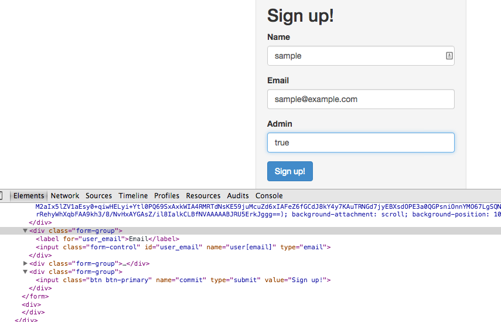
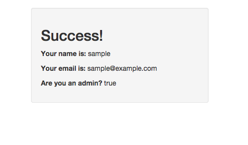

# Make yourselves an admin user!

Using _only_ the chrome web inspector, take your knowledge of how HTML inputs and
Rails params work, and craft a request that can make users admin users.

You'll know you are done when it says that you are an admin user, like so:

These are the screen shots from the hack. One contains the code typed in the developer tools and the other has the final screen shot that gave me the "success" message.

